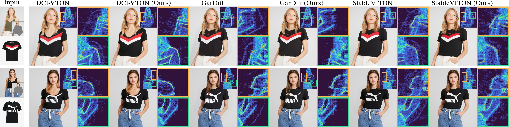

# ART-VITON: Measurement-Guided Latent Diffusion for Artifact-Free Virtual Try-On




# SetUP

## Create a Conda Environment

```
git clone https://github.com/qkrwnstj306/ART-VITON.git
cd ART-VITON
conda create --name art-viton python=3.10 -y
conda activate art-viton
pip install --upgrade pip
pip install torch==2.0.0+cu117 torchvision==0.15.1+cu117 torchaudio==2.0.1+cu117 -f https://download.pytorch.org/whl/torch_stable.html
pip install -r requirements.txt
conda install -c anaconda ipython -y
```

## Download StableVITON Checkpoints and VITON-HD Dataset

Please refer to the official StableVITON repository:

[StableVITON GitHub Repository](https://github.com/rlawjdghek/StableVITON.git)

# Inference 

## Generate images

```
## Paired setting
CUDA_VISIBLE_DEVICES=0 python inference.py \
    --data_root_dir ./dataset/zalando-hd-resized \
    --config_path ./configs/VITONHD.yaml \
    --batch_size 1 \
    --cfg_scale 1 \
    --model_load_path ./ckpts/VITONHD.ckpt \
    --modify_final_t \
    --use_pure_to_prior \
    --apply_lm \
    --save_dir ./results

## Unpaired setting
CUDA_VISIBLE_DEVICES=0 python inference.py \
    --data_root_dir ./dataset/zalando-hd-resized \
    --config_path ./configs/VITONHD.yaml \
    --batch_size 1 \
    --cfg_scale 1 \
    --model_load_path ./ckpts/VITONHD.ckpt \
    --modify_final_t \
    --use_pure_to_prior \
    --apply_lm \
    --unpair \
    --save_dir ./results
```

## Generate artifact maps

```
## For paired setting
python generate_artifact_map.py

## For unpaired setting
python generate_artifact_map.py --unpair
```

# License

ART-VITON builds upon ideas and resources from StableVITON, which is licensed under
[CC BY-NC-SA 4.0](https://creativecommons.org/licenses/by-nc-sa/4.0/legalcode).

We gratefully acknowledge the StableVITON team for their code and datasets, which
greatly facilitated our work. ART-VITON is released under the same CC BY-NC-SA 4.0 license.
Commercial use is not permitted.

