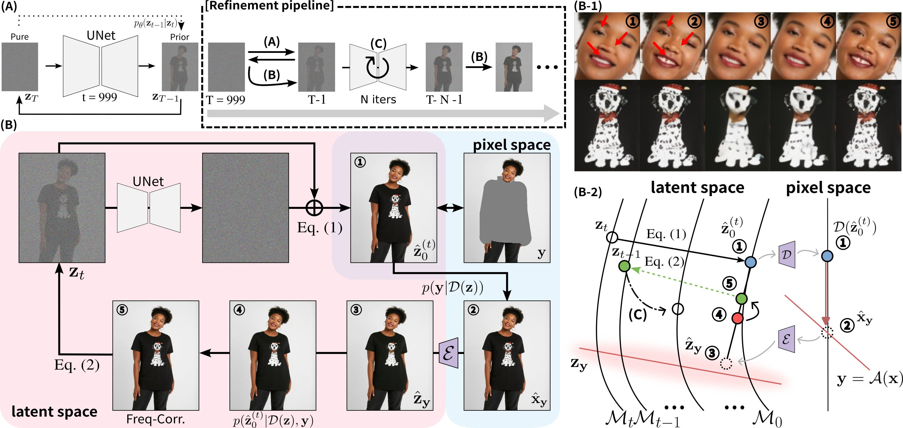

# ART-VITON: Measurement-Guided Latent Diffusion for Artifact-Free Virtual Try-On

**Junseo Park** and **Hyeryung Jang**  
Dongguk University

---

  
*Figure 1. Overview of the ART-VITON framework.*

[**Paper**](./path/to/paper.pdf) | [**GitHub**](https://github.com/qkrwnstj306/ART-VITON)

---

## Abstract

Virtual try-on (VITON) aims to generate realistic images of a person wearing a target garment, requiring precise garment alignment in try-on regions and faithful preservation of identity and background in non-try-on regions. While latent diffusion models (LDMs) have advanced alignment and detail synthesis, preserving non-try-on regions remains challenging. A common post-hoc strategy directly replaces these regions with original content, but abrupt transitions often produce boundary artifacts. To overcome this, we reformulate VITON as a linear inverse problem and adopt trajectory-aligned solvers that progressively enforce measurement consistency, reducing abrupt changes in non-try-on regions. However, existing solvers still suffer from semantic drift during generation, leading to artifacts. We propose $\textsf{ART-VITON}$, a measurement-guided diffusion framework that ensures measurement adherence while maintaining artifact-free synthesis. Our method integrates residual prior-based initialization to mitigate training-inference mismatch and artifact-free measurement-guided sampling that combines data consistency, frequency-level correction, and periodic standard denoising. Experiments on VITON-HD, DressCode, and SHHQ-1.0 demonstrate that $\textsf{ART-VITON}$ effectively preserves identity and background, eliminates boundary artifacts, and consistently improves visual fidelity and robustness over state-of-the-art baselines.
---

## Method

  
*Figure 2. Illustration of the ART-VITON method. The framework leverages measurement guidance in latent diffusion to preserve garment consistency while mitigating artifacts.*

---

## Results

  
  
  

Our method outperforms existing approaches in both visual quality and artifact reduction, as demonstrated in the examples above.  

---

## Citation

If you use ART-VITON in your research, please cite our work:

```bibtex
@inproceedings{park2025artviton,
  title={ART-VITON: Measurement-Guided Latent Diffusion for Artifact-Free Virtual Try-On},
  author={Junseo Park and Hyeryung Jang},
  booktitle={Conference/Journal Name},
  year={2025}
}
